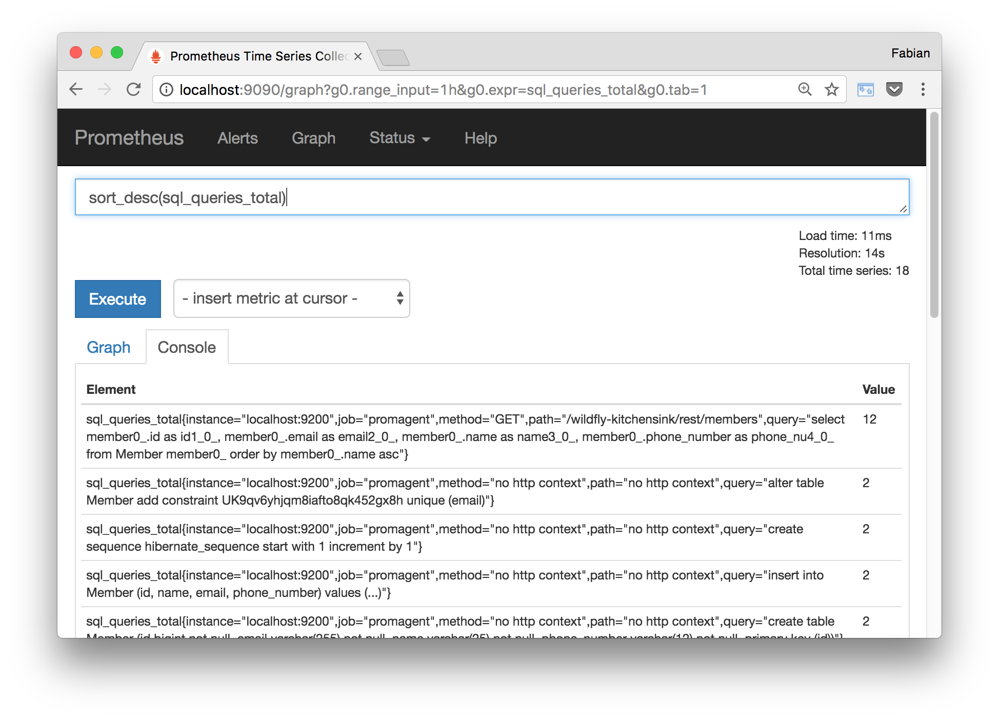

[](https://travis-ci.org/fstab/promagent)

Promagent
=========

_Prometheus Monitoring for Java Web Applications without Modifying their Source Code._

The `promagent-maven-plugin` is a tool for creating _custom Java agents_ for [Prometheus](https://prometheus.io/) monitoring.
The Java agents instrument Java Web Applications with [Prometheus](https://prometheus.io/) metrics without modifying the applications' source code.
The agents use the [Byte Buddy](http://bytebuddy.net/) bytecode manipulation library to insert Prometheus metrics during application startup.

The Promagent code repository contains two projects:

- `promagent-framework`: Provides, among other things, the `promagent-api` and the `promagent-maven-plugin` helping you to create your own agents.
- `promagent-example`: An example agent providing metrics for _Spring Boot_ and _Java EE_ applications:
  - HTTP: Number and duration of web requests.
  - SQL: Number and duration of database queries (including the HTTP context if the query was triggered by a REST call).

The example agent was tested with [Tomcat](http://tomcat.apache.org/) for the [Spring Boot](https://projects.spring.io/spring-boot/) example and with the [Wildfly application server](http://wildfly.org/) for the [Java EE](http://www.oracle.com/technetwork/java/javaee/tech/index.html) example.

Example
-------



### Downloading and Compiling the Example Agent

Clone [Promagent](https://github.com/fstab/promagent) from GitHub:

```bash
git clone https://github.com/fstab/promagent.git
cd promagent
```

The `promagent-api` and `promagent-maven-plugin` are not on Maven Central yet. Run the following commands to make them available locally (in `~/.m2/repository/`):

```bash
cd promagent-framework
mvn clean install
cd ..
```

Compile the example agent. This should create the file `./promagent-example/target/promagent.jar`:

```bash
cd promagent-example
mvn clean verify
cd ..
```

### Spring Boot Demo

_The following runs with Java 8 and was not tested with Java 9 yet._

Download and compile a [Spring Boot Getting Started](https://spring.io/guides/gs/accessing-data-rest/) application.

```bash
git clone https://github.com/spring-guides/gs-accessing-data-rest.git
cd gs-accessing-data-rest/complete
mvn clean package
cd ../..
```

Run the Spring Boot application with the Promagent attached.

```bash
java \
    -javaagent:promagent/promagent-example/target/promagent.jar=port=9300 \
    -jar gs-accessing-data-rest/complete/target/gs-accessing-data-rest-0.1.0.jar
```

Go to [http://localhost:8080](http://localhost:8080) to view the Spring Boot application,
go to [http://localhost:9300/metrics](http://localhost:9300/metrics) to view the Prometheus metrics.

### Java EE Demo on Wildfly

_This demo runs with Java 8. For a Java 9 version, see [JAVA_9_DEMO.md](JAVA_9_DEMO.md)._

Download and compile a [Wildfly Quickstart](https://github.com/wildfly/quickstart) application.

```bash
git clone https://github.com/wildfly/quickstart.git
cd quickstart/kitchensink
mvn clean package
cd ../..
```

Download and extract the [Wildfly application server](http://wildfly.org/).

```bash
curl -O http://download.jboss.org/wildfly/10.1.0.Final/wildfly-10.1.0.Final.tar.gz
tar xfz wildfly-10.1.0.Final.tar.gz
```

Run the Wildfly application server with the Promagent attached.

```bash
cd wildfly-10.1.0.Final
LOGMANAGER_JAR=$(find $(pwd) -name 'jboss-logmanager-*.jar')
export JAVA_OPTS="
    -Xbootclasspath/p:${LOGMANAGER_JAR}
    -Djboss.modules.system.pkgs=org.jboss.logmanager,io.promagent.agent
    -Djava.util.logging.manager=org.jboss.logmanager.LogManager
    -javaagent:../promagent/promagent-example/target/promagent.jar=port=9300
"
./bin/standalone.sh
```

In a new Shell window, deploy the quickstart application.

```bash
cd wildfly-10.1.0.Final
./bin/jboss-cli.sh --connect --command="deploy ../quickstart/kitchensink/target/kitchensink.war"
```

Go to [http://localhost:8080/kitchensink](http://localhost:8080/kitchensink) to view the quickstart application,
go to [http://localhost:9300/metrics](http://localhost:9300/metrics) to view the Prometheus metrics.

Creating your Own Agent
-----------------------

A Promagent is implemented as a set of Hooks. A Hook is a Java class meeting the following requirements:

* The class is annotated with `@Hook`.
* The class has a public constructor taking a single parameter of type `MetricsStore`.
* The class provides methods annotated with `@Before` or `@After`. Those methods must take exactly the same parameters as the method you want to intercept (there is one exception to that rule: `@Afer` methods may have two additional parameters annotated with `@Returned` and `@Thrown`, see _Hook Annotations_ below).

The best way to get started is to have a look at the `ServletHook` and `JdbcHook` in the `promagent-example`.

A simple Hook counting the number of Servlet requests looks as follows:

```java
@Hook(instruments = "javax.servlet.Servlet")
public class ServletHook {

    private final Counter servletRequestsTotal;

        public ServletHook(MetricsStore metricsStore) {
            servletRequestsTotal = metricsStore.createOrGet(new MetricDef<>(
                    "servlet_requests_total",
                    (name, registry) -> Counter.build()
                        .name(name)
                        .help("Total number of Servlet requests.")
                        .register(registry)
            ));
        }

        @After(method = "service")
        public void after(ServletRequest request, ServletResponse response) {
            httpRequestsTotal.inc();
        }
}
```

To build a Promagent project with Maven, you need two entries in the `pom.xml`. First, the `promagent-api` must be included as a dependency:

```xml
<dependency>
    <groupId>io.promagent</groupId>
    <artifactId>promagent-api</artifactId>
    <version>1.0-SNAPSHOT</version>
    <scope>provided</scope> <!-- provided at runtime by the internal agent implementation -->
</dependency>
```

Second, the `promagent-maven-plugin` that creates an agent JAR:

```xml
<build>
    <finalName>promagent</finalName>
    <plugins>
        <plugin>
            <groupId>io.promagent</groupId>
            <artifactId>promagent-maven-plugin</artifactId>
            <version>1.0-SNAPSHOT</version>
            <executions>
                <execution>
                    <id>promagent</id>
                    <phase>package</phase>
                    <goals>
                        <goal>build</goal>
                    </goals>
                </execution>
            </executions>
        </plugin>
    </plugins>
</build>
```

With these two things included, `mvn clean package` should produce a working Java agent in `target/promagent.jar`.

### A Hook's Life Cycle

A Hook's lifecycle depends on whether the instrumented method call is a _nested_ call or not. A call is _nested_ when the method is called by another method that was instrumented with the same hook.
This happens for example if a Servlet's service() method calls another Servlet's service() method.

By default, _nested_ calls are ignored and the Hook is only invoked for the outer call.
In the Servlet example, this is the intended behavior, because it guarantees that each HTTP request is counted only once, even even if a Servlet internally calls another Servlet to handle the request.

If the Hook is defined with `@Hook(skipNestedCalls = false)` the Hook will be invoked for all _nested_ calls, not only for the outer call.

For each outer call, a new Hook instance is created. If the Hook implements both a `@Before` and an `@After` method, the same instance is used for `@Before` and `@After`. That way, you can set a start time as a member variable in the `@Before` method, and use it in the `@After` method to calculate the duration of the call.

For _nested_ calls, the Hook instance from the outer call is re-used. That way, you can put data into member variables in order to pass that data down the call stack.

### The Hook's Constructor Parameter

Most applications use static variables to maintain Prometheus metrics, as described in the [Prometheus Client Library for Java](https://github.com/prometheus/client_java) documentation:

```java
# Doesn't work with Promagent
static final Counter counter = Counter.build()
    .name("requests_total")
    .help("Total requests.")
    .register();
```

Unfortunately, static variables are maintained per deployment in an application server. When an application is re-deployed, a new instance of the same `Counter` is created, which causes conflicts in the Prometheus registry (as the Prometheus registry is maintained by Promagent, it survives re-deployments).
Moreover, it is impossible to instrument a mix of internal modules (like an internal Servlet in the JAX-RS implementation) and deployments (like Servlets in a WAR file) with static variables.

To prevent this, Promagent requires Hooks to use the `MetricsStore` to maintain metrics:

```java
# This is the correct way with Promagent
Counter counter = metricsStore.createOrGet(new MetricDef<>(
                    "requests_total",
                    (name, registry) -> Counter.build()
                        .name(name)
                        .help("Total requests.")
                        .register(registry)
            ));
```

The Promagent library will take care that the `Counter` is created only once, and that the `Counter` instance is re-used across multiple deployments and internal modules in an application server.

### Hook Annotations

* `@Hook`: Hook classes are annotated with `@Hook(instruments = {...}, skipNestedCalls = true)`. The `instruments` parameter takes a list of Strings specifying the names of the classes or interfaces to be instrumented, like `{"javax.servlet.Servlet", "javax.servlet.Filter"}`. The Hook instruments not only the classes or interfaces themselves, but all sub-classes or implementations of these classes or interfaces. The `skipNestedCalls` parameter is described in _A Hook's Life Cycle_ above.
* `@Before`: Hook methods annotated with `@Before(method = {...})` are invoked when an instrumented method is entered. The `method` parameter takes a list of Strings specifying the names of the intercepted methods, like `{"service", "doFilter"}`. The number and types of arguments are derived from the method itself, i.e. the Hook method annotated with `@Before` must take the exact same parameters as the methods it wants to instrument.
* `@After`: Hook methods annotated with `@After(method = {...})` are invoked when an instrumented method is left. `@After` methods are always called, even if the instrumented method terminates with an Exception. The semantics is the same as with the `@Before` annotation. Methods annotated with `@After` may have two additional parameters, one parameter annotated with `@Returned` and one parameter annotated with `@Thrown`. These parameters are ignored when determining the signature of the instrumented method.
* `@Returned`: It might be useful to learn the return value of an instrumented method. In order to do so, methods annotated with `@After` may have an additional parameter annotated with `@Returned`, where the type corresponds to the return type of the intercepted method. If the instrumented method returns regularly, the return value is provided. If the method returns exceptionally, `null` (or the default type for primitive types, like `0` for `int`) is provided. `@Returned` parameters are only allowed in `@After` methods, not in `@Before` methods.
* `@Thrown`: The `@Thrown` annotation is like `@Returned`, but to learn an Exception thrown from an instrumented method. The type should be `Throwable` to avoid class cast errors on unexpected RuntimeExceptions or Errors. If the instrumented method does not throw an exception, the parameter annotated with `@Thrown` will be `null`.

### Using Labels

The Prometheus server internally stores one time series for each observed set of label values. The time series database in the Prometheus server can easily handle thousands of different time series, but millions of different time series could be a problem.
Therefore, it is important to keep the number of different label values relatively small. Unique user IDs, timestamps, or session keys should not be used as label values.

The `promagent-example` strips HTTP URLs and SQL queries to make sure that there are not too many different label values:

* For HTTP requests, path parameters are replaced with placeholders. The goal is to use REST resources like `/item/{id}` as labels, not in actual paths like `/item/123`.
* For SQL queries, values are stripped. The goal is to use the structure of the query like `INSERT INTO ITEMS (ID, NAME, PRICE) VALUES (...)` as a label, not in its values like `INSERT INTO ITEMS (ID, NAME, PRICE) VALUES (23, 'abc', 17.5)`.

Of course, replacing path parameters and SQL values is application specific. The `promagent-example` implements a very simple replacement in `ServletHook.stripPathParameters()` and `JdbcHook.stripValues()`, but you probably need to customize these methods for your application.

### Running Docker Tests

The `promagent-example` project contains an alternative Maven configuration in `pom-with-docker-tests.xml`.
This configuration uses the `docker-maven-plugin` to create Docker images and run integration tests against Docker containers.

The Wildfly tests can be run as follows:

```bash
cd promagent-example
mvn -f pom-with-docker-tests.xml clean verify -Pwildfly
cd ..
```

The Spring Boot tests can be run as follows:

```bash
cd promagent-example
mvn -f pom-with-docker-tests.xml clean verify -Pspring
cd ..
```

The first run takes a while, because the Docker images need to be built. Once the images are available on the local systems, runs are significantly faster.

Exposing Metrics
----------------

Promagent supports three different ways of exposing metrics to the Prometheus server:

* The agent has a built-in HTTP server. This is used in the examples above. The server is started when the
  command line argument `port` is used, as for example `-javaagent:agent.jar=host=localhost,port=9300`.
  The `host` argument is optional, it defaults to the wildcard IP address.
  If `port` is omitted the built-in server is not started.
* The [promagent-exporter](https://github.com/fstab/promagent/tree/master/promagent-framework/promagent-exporter) module implements
  a simple Web application in WAR file format. If you deploy the _promagent-framework/promagent-exporter/target/promagent.war_ on your
  server, it will collect Promagent metrics via JMX and expose them under its deployment URL,
  like [http://localhost:8080/promagent](http://localhost:8080/promagent).
* All metrics are made available via JMX, so any JMX client can be used to access the metrics.

Status
------

This is a demo project. The main goal is to learn the internals of bytecode manipulation and class loading in Java application servers. I am planning to work on the following:

* Try it with more application servers ([Payara](http://www.payara.fish/), [TomEE](http://tomee.apache.org/)) and adjust the code if necessary.
* Write documentation about the internal implementation, mainly the bytecode manipulation and class loading aspects.
* Generalize the concept so that users can not only write Hooks, but also other collectors. A proof-of-concept is includes in the class `JmxCollector` in `promagent-example`.
* Generalize the concept so we don't only support monitoring with Prometheus, but also tracing with OpenTracing API compatible tools.

The `promagent-api` and `promagent-maven-plugin` are not yet available on Maven Central, but they will be uploaded when the API becomes a bit more stable.

If you want to write your own agent and are looking for examples of methods you might want to instrument, look at related projects, like [inspectIT](http://www.inspectit.rocks/) (hooks are configured [here](https://github.com/inspectIT/inspectIT/tree/master/inspectit.server/src/main/external-resources/ci/profiles/common)) or [stagemonitor](http://www.stagemonitor.org/).

Resources
---------

* [Prometheus Monitoring for Java Web Applications w o Modifying Source Code ](https://www.youtube.com/watch?v=BjyI93c8ltA) (youtube.com), video from my Devoxx 2017 talk.
* [Instrumenting Java Web Applications without Modifying their Source Code](https://www.javacodegeeks.com/2017/07/instrumenting-java-web-applications-without-modifying-source-code.html) (Java Code Geeks).

Thank You ConSol
----------------

This project is supported as part of the R&D activities at [ConSol Software GmbH](https://www.consol.de/). See the [ConSol Labs Blog](https://labs.consol.de/) for more info.
